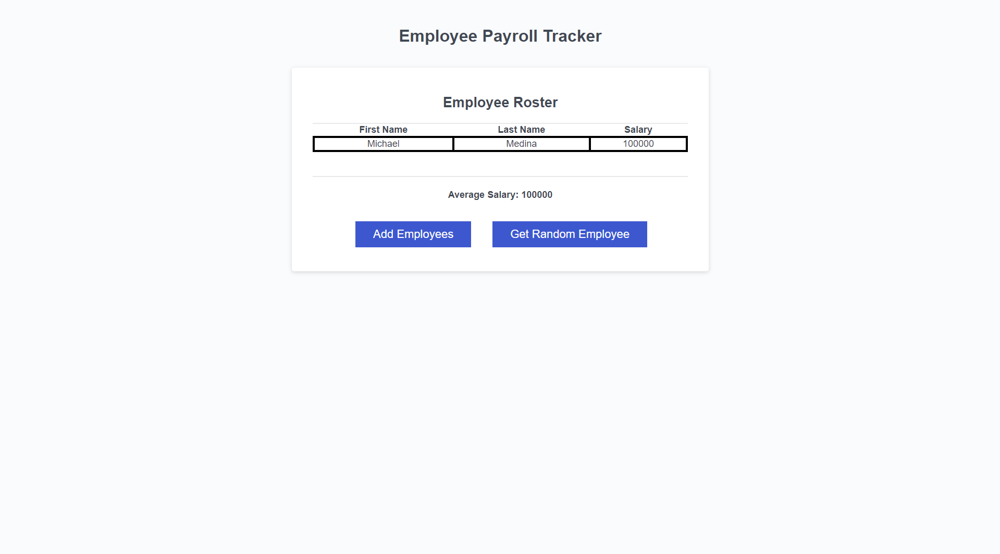

# Employee-Organizer
A simple JavaScript application that takes in employee data, saves it to local storage, and displays it in a table along with the average salary and random employee selector.

## Installation

You'll need to install [Git](https://git-scm.com/downloads) if you haven't already.

Run the following commands in Terminal (Mac/Linux) or Git Bash (Windows) to clone the repository in your desired directory.
```
cd $desired_directory
git clone https://github.com/mikemedina22800/Employee-Organizer
```
Open index.html in your browser.

Edit the source code in an Integrated Development Environment such as [Visual Studio Code](https://code.visualstudio.com/) to see changes reflected in your browser after refreshing. Happy hacking!


Github Pages Link: https://mikematics22800.github.io/Employee-Organizer


